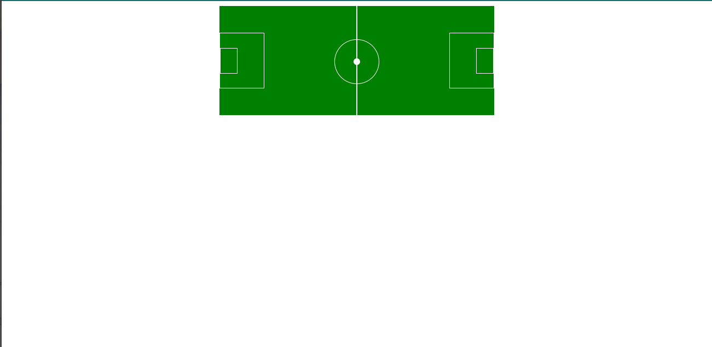

## Objectif

En CSS l'essentiel du positionnement ce gère avec les propriétés flexbox (`display: flex;`, `justify-content`, `align-items`, `flex-direction` ...).
Ces propriétés sont relativement simples mais demandent pas mal de pratique pour être bien comprises et maitrisées.
C'est l'objectif de ces gammes d'exercices. Un peu dans l'esprit d'un musicien qui doit réviser ses gammes, ces taches
vous feront réalisés des séries d'exercices pour pratiquer.

## Cours associés

II - 1/ Positionnement

## Definition of Done

_Une tache est considérée comme complétée lorsque chacune des sous-taches de cette section ont été complétées._

Pour **chacune** des maquettes:

- [ ] La maquette est bien reproduite

<!-- CODE_QUALITY_START -->
Code quality:

- [ ] HTML: 0 erreurs/warnings selon les standards du W3C
- [ ] HTML: Les textes visibles ne comportent pas de fautes d'orthographe
- [ ] HTML: Les textes visibles commencent tous par une majuscule
- [ ] HTML - SEO: title, description et favicon ont été renseignés
- [ ] HTML - SEO: Si c'est pertinent, les balises sémantiques <header>, <footer>, <main>, <nav>, <section> ont été utilisées
- [ ] CSS: Aucun padding ni margin négatif
- [ ] CSS: Le css comporte un "reset CSS"
- [ ] JS: Le code est commenté
- [ ] JS: Pas d'erreur ni de logs inutiles dans la console
- [ ] Global: Les `class`, `id` et `name` et autres variables ont des noms respectables et porteurs de sens

<!-- CODE_QUALITY_END -->

## Q&A

_Cette section sera complétée par votre formateur lors de la review des taches._
